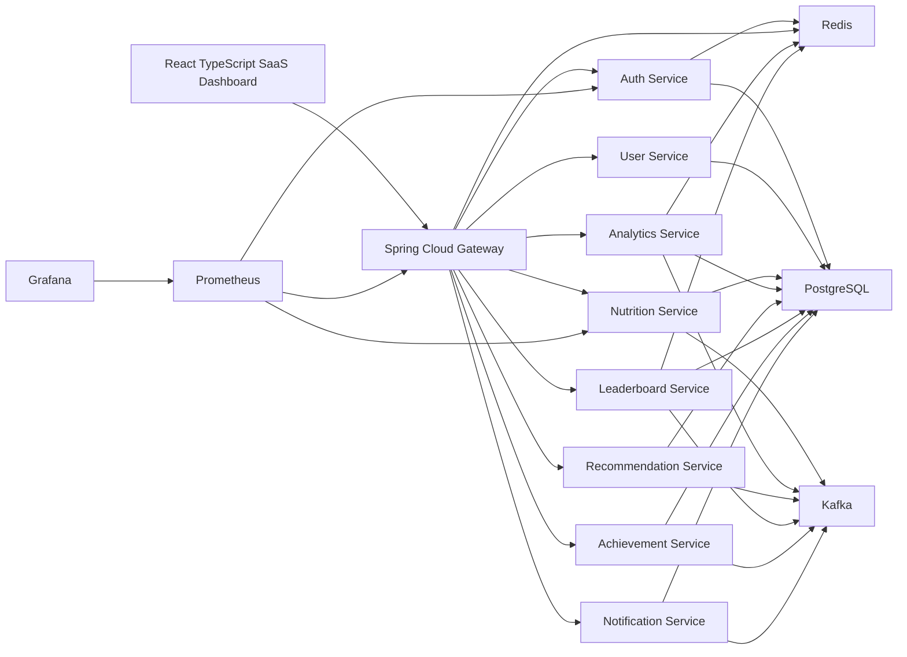

# NutriLens

A Distributed Nutrition Intelligence and Dietary Analytics Platform.

NutriLens transforms the original Diet Scanner project into an analytics-first SaaS platform for dietary behavior, nutrition consistency, macro balance, meal quality, gamification, and community rankings. Food scanning is now an ingestion workflow inside a larger event-driven nutrition intelligence system.

## Product Vision

NutriLens is designed to feel like Spotify Analytics meets Strava Analytics meets MyFitnessPal Intelligence:

- score nutrition quality, consistency, hydration, macro balance, and diet quality
- detect behavioral patterns such as skipped breakfast, late-night eating, protein gaps, calorie spikes, and weekend overeating
- generate deterministic, evidence-backed recommendations without fake AI
- power live leaderboards and achievements through Kafka and Redis
- expose production observability through Actuator, Micrometer, Prometheus, and Grafana

## Architecture



The design contract lives in [docs/NUTRILENS_SYSTEM_DESIGN.md](docs/NUTRILENS_SYSTEM_DESIGN.md).

## Tech Stack

Frontend:

- React, TypeScript, Vite, Tailwind CSS
- ShadCN-inspired UI primitives
- Zustand, TanStack Query
- Framer Motion, Recharts

Backend:

- Java 21, Spring Boot 3, Maven
- Spring Security, OAuth2 Client, Resource Server
- Spring Cloud Gateway, OpenFeign, Scheduler, WebSocket
- Spring Data JPA, Flyway
- Kafka, Redis, PostgreSQL
- Micrometer, Actuator, Prometheus

Infrastructure:

- Docker, Docker Compose
- Prometheus, Grafana
- GitHub Actions CI/CD

## Microservices

| Service | Responsibility |
| --- | --- |
| `gateway-service` | Routing, JWT validation, Redis rate limiting, CORS, request IDs, dashboard aggregation |
| `auth-service` | OAuth2 login, JWT access tokens, refresh token rotation, token families, revocation, JWK endpoint |
| `user-service` | Profiles, activity level, dietary preference, goals, body measurements |
| `nutrition-service` | Food search, barcode scan, label scan parsing, meal logging, nutrition aggregation, meal events |
| `analytics-service` | Nutrition score, consistency score, hydration score, macro balance, behavior detection, insights |
| `recommendation-service` | Evidence-backed recommendations, weekly and monthly summaries |
| `leaderboard-service` | Redis sorted-set global, country, weekly, monthly, and challenge rankings |
| `achievement-service` | Asynchronous achievement rule evaluation and unlock events |
| `notification-service` | Notification inbox, preferences, Kafka-driven notifications, WebSocket pushes |

## Repository Layout

```text
services/                 Java 21 Spring Boot multi-module backend
frontend/                 React TypeScript SaaS dashboard
infra/docker/             Prometheus and Grafana provisioning
docs/                     Architecture and technical design
legacy/                   Archived original Node/MySQL/static Diet Scanner implementation
docker-compose.yml        Full local platform runtime
.github/workflows/        CI and deployment workflows
```

## Local Setup

Prerequisites:

- Java 21
- Maven 3.9+ for local backend builds
- Node 22+
- Docker and Docker Compose for full platform runtime

Frontend:

```bash
cd frontend
npm install
npm run dev
```

Backend with Maven:

```bash
cd services
mvn test
```

This machine currently has Java and Node available, but not Maven or Docker. The Docker build uses a Maven image, so a machine with Docker can build backend services without host Maven.

## Docker Setup

Run the full platform:

```bash
docker compose up --build
```

Local URLs:

- Frontend: `http://localhost:3000`
- Gateway: `http://localhost:8080`
- Prometheus: `http://localhost:9090`
- Grafana: `http://localhost:3001`
- PostgreSQL: `localhost:5432`
- Redis: `localhost:6379`
- Kafka: `localhost:9092`

## Environment Variables

Copy [.env.example](.env.example) and provide secrets where needed.

Required for local defaults:

- `DATABASE_URL`
- `DATABASE_USERNAME`
- `DATABASE_PASSWORD`
- `REDIS_HOST`
- `REDIS_PORT`
- `KAFKA_BOOTSTRAP_SERVERS`
- `AUTH_ISSUER`

Manual production inputs:

- Google OAuth credentials
- GitHub OAuth credentials
- Apple OAuth credentials
- cloud deployment secrets
- domain and TLS configuration

## Kafka Topics

- `auth.user-registered.v1`
- `auth.user-logged-in.v1`
- `auth.session-revoked.v1`
- `users.profile-updated.v1`
- `users.goal-updated.v1`
- `nutrition.meal-logged.v1`
- `nutrition.meal-updated.v1`
- `nutrition.meal-deleted.v1`
- `nutrition.food-created.v1`
- `nutrition.goal-reached.v1`
- `analytics.daily-computed.v1`
- `analytics.weekly-report-generated.v1`
- `analytics.insight-generated.v1`
- `gamification.streak-updated.v1`
- `gamification.achievement-unlocked.v1`
- `gamification.challenge-completed.v1`
- `leaderboard.updated.v1`
- `recommendations.recommendation-generated.v1`
- `notifications.notification-created.v1`

## Redis Usage

- Gateway rate limiting
- Refresh token session mirror
- JWT blacklist entries
- Analytics cache
- Recommendation cache
- Streak counters
- Global, country, weekly, monthly, and challenge sorted-set rankings

## Analytics Features

Implemented deterministic intelligence:

- nutrition score
- macro balance score
- consistency score
- hydration score
- diet quality score
- skipped breakfast detection
- late-night eating detection
- protein trend insight generation
- daily analytics projections
- event-driven downstream recommendations, rankings, achievements, and notifications

## Authentication Flow

1. User signs in through Google, GitHub, Apple, or local development login.
2. Auth Service creates or finds OAuth identity.
3. Auth Service issues RSA-signed JWT access token.
4. Auth Service stores hashed rotating refresh token family in PostgreSQL and mirrors session metadata in Redis.
5. Gateway validates JWT through `/.well-known/jwks.json`.
6. Gateway forwards `X-User-Id`, `X-User-Email`, and `X-Request-Id` to internal services.

## Screenshots

Screenshot slots for repository presentation:

- Dashboard with score cards, macro chart, trend graph, and consistency heatmap
- Analytics page with nutrition, consistency, hydration, and macro trends
- Insights page with evidence-backed behavioral insights
- Nutrition page with food search, barcode scan, and label scan
- Leaderboard page with Redis-powered rankings
- Achievements page with unlock states

## Deployment Guide

Recommended production topology:

```text
CDN / TLS Edge
  -> Load Balancer
  -> Gateway replicas
  -> Spring Boot service replicas
  -> Managed PostgreSQL
  -> Managed Redis
  -> Managed Kafka
  -> Prometheus / Grafana / log backend
```

Production hardening checklist:

- provide real OAuth credentials and redirect URIs
- use managed database, cache, and Kafka
- replace generated local JWT key material with managed signing keys
- configure TLS, domain, WAF, and rate limit policy
- configure logs, traces, alerts, and backup policies

## CI/CD Overview

GitHub Actions includes:

- backend Maven tests
- frontend install, build, and lint
- Docker image build matrix for all backend services
- manual deployment workflow with environment selection

Branch protection recommendation:

- require PR review
- require CI checks
- block direct pushes to `main`
- require code owner review for auth, gateway, common modules, and infrastructure

