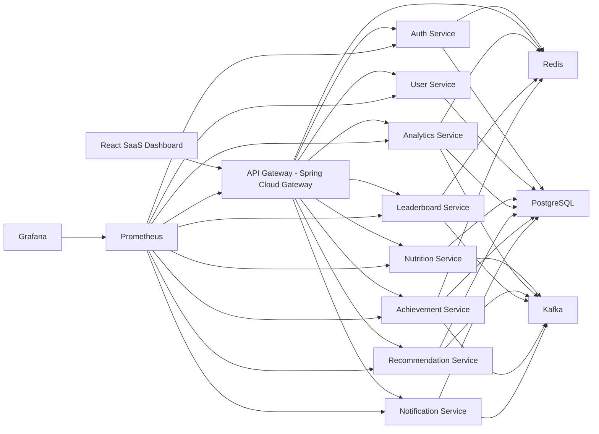
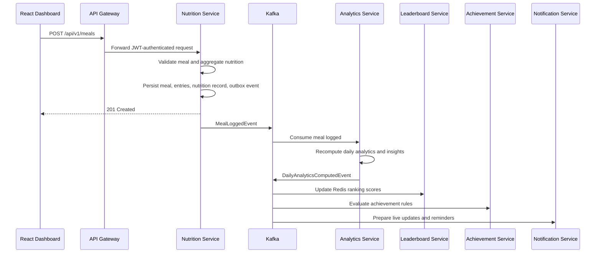
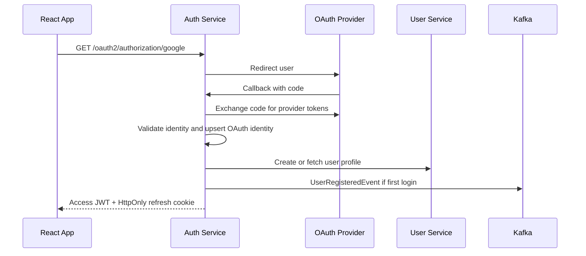

# NutriLens System Design

Product: NutriLens

Tagline: A Distributed Nutrition Intelligence and Dietary Analytics Platform.

Status: Target architecture for Diet Scanner 2.0

## 1. Complete System Architecture

NutriLens should evolve from a scanner-first app into a distributed analytics platform where food capture is only the data ingestion layer. The product value is generated by analytics, scoring, trends, behavioral insights, recommendations, challenges, leaderboards, and event-driven notifications.

The platform is designed as independently deployable Spring Boot services behind a Spring Cloud Gateway. Services own their data, publish domain events to Kafka, cache read-heavy surfaces in Redis, and expose metrics through Micrometer and Spring Actuator.

### Target Principles

- Microservices over monolith: each service owns a bounded business capability.
- PostgreSQL for durable state, with logical schemas locally and separate databases in production.
- Kafka for asynchronous domain events and cross-service workflows.
- Redis for leaderboards, rate limits, refresh sessions, cached analytics, and challenge rankings.
- Gateway-enforced auth, rate limits, CORS, request logging, and routing.
- OAuth-first authentication with JWT access tokens and rotating refresh tokens.
- Analytics-based intelligence only: no fake AI advice, no opaque generated claims.
- Clean Architecture inside services: domain rules separated from API, persistence, messaging, and framework code.
- Observable by default: metrics, health checks, traces, structured logs, dashboards, and alert-ready signals.

### High-Level Runtime Diagram



### Request and Event Model

Synchronous REST should be used for user-facing reads, commands that need immediate validation, and API aggregation. Asynchronous Kafka events should be used for analytics updates, achievements, recommendations, notifications, reports, challenge progress, and leaderboard recalculation.

Example meal flow:



## 2. Service-by-Service Breakdown

### API Gateway Service

Purpose: single public API entry point.

Responsibilities:

- Route `/api/v1/auth/**`, `/api/v1/users/**`, `/api/v1/nutrition/**`, `/api/v1/analytics/**`, `/api/v1/recommendations/**`, `/api/v1/leaderboards/**`, `/api/v1/achievements/**`, and `/api/v1/notifications/**`.
- Validate JWT access tokens using Auth Service public JWKs.
- Apply Redis-backed rate limiting per user, IP, and route class.
- Enforce CORS, security headers, request size limits, and request IDs.
- Aggregate dashboard summary reads by calling Analytics, Nutrition, Leaderboard, and Achievement services.
- Emit structured access logs and Micrometer metrics.

Key dependencies:

- Spring Cloud Gateway
- Spring Security Resource Server
- Redis reactive rate limiter
- Resilience4j timeouts and circuit breakers

Core endpoints:

- `GET /api/v1/dashboard/summary`
- `GET /api/v1/health/services`
- `GET /actuator/health`
- `GET /actuator/prometheus`

### Authentication Service

Purpose: OAuth-first identity, JWT, refresh token rotation, and session security.

Responsibilities:

- Google, GitHub, and Apple OAuth2 login.
- Issue short-lived signed JWT access tokens.
- Rotate refresh tokens on every refresh.
- Store refresh token family metadata and revocation state.
- Blacklist compromised access token IDs until expiry.
- Publish `UserRegisteredEvent`, `UserLoggedInEvent`, and `SessionRevokedEvent`.

Data ownership:

- OAuth identities
- Refresh token families
- Revoked token IDs
- Login audit records

Security decisions:

- Use asymmetric JWT signing, for example RSA or EC keys.
- Access token TTL: 10 to 15 minutes.
- Refresh token TTL: 14 to 30 days.
- Store refresh token hashes, never raw refresh tokens.
- Detect refresh token reuse and revoke the whole token family.
- Set browser refresh cookies as `HttpOnly`, `Secure`, `SameSite=Lax` in production.

Core endpoints:

- `GET /api/v1/auth/oauth2/authorization/{provider}`
- `GET /api/v1/auth/oauth2/callback/{provider}`
- `POST /api/v1/auth/refresh`
- `POST /api/v1/auth/logout`
- `GET /api/v1/auth/me`
- `GET /.well-known/jwks.json`

### User Service

Purpose: profile, preferences, health context, and user goal management.

Responsibilities:

- Store profile and onboarding data.
- Manage age, height, weight, activity level, gender, dietary preference, country, timezone, and fitness goal.
- Publish profile and goal change events.
- Provide user context to Recommendation and Analytics services through internal APIs.

Data ownership:

- `users`
- `user_profiles`
- `user_goals`
- `user_preferences`
- `body_measurements`

Core endpoints:

- `GET /api/v1/users/me`
- `PATCH /api/v1/users/me/profile`
- `PATCH /api/v1/users/me/goals`
- `POST /api/v1/users/me/body-measurements`
- `GET /api/v1/users/me/preferences`
- `PATCH /api/v1/users/me/preferences`

### Nutrition Service

Purpose: food capture and nutrition ingestion.

Responsibilities:

- Barcode and QR lookup.
- Food search and custom food creation.
- Meal and meal entry creation.
- Nutrition aggregation per meal and per day.
- Preserve the current project strength: label/OCR scanning can become an ingestion mode behind this service.
- Publish `MealLoggedEvent`, `MealUpdatedEvent`, `MealDeletedEvent`, `FoodCreatedEvent`, and `NutritionGoalReachedEvent`.

Data ownership:

- `foods`
- `food_nutrition`
- `meals`
- `meal_entries`
- `nutrition_records`
- `scan_jobs`

Core endpoints:

- `GET /api/v1/nutrition/foods/search?q=&barcode=`
- `POST /api/v1/nutrition/foods/custom`
- `GET /api/v1/nutrition/foods/{foodId}`
- `POST /api/v1/nutrition/meals`
- `GET /api/v1/nutrition/meals?from=&to=`
- `PATCH /api/v1/nutrition/meals/{mealId}`
- `DELETE /api/v1/nutrition/meals/{mealId}`
- `POST /api/v1/nutrition/scans/barcode`
- `POST /api/v1/nutrition/scans/label`
- `GET /api/v1/nutrition/scans/{scanId}`

### Analytics Service

Purpose: core intelligence engine and the most important service.

Responsibilities:

- Consume meal, hydration, profile, and goal events.
- Compute daily, weekly, and monthly analytics.
- Compute nutrition score, macro balance score, consistency score, hydration score, and diet quality score.
- Detect behavioral patterns such as skipped breakfasts, late-night calories, calorie spikes, weekend overeating, protein deficiency trends, and inconsistent meal timing.
- Persist analytics snapshots and insights.
- Cache dashboard analytics in Redis.
- Publish `DailyAnalyticsComputedEvent`, `WeeklyReportGeneratedEvent`, `MonthlyReportGeneratedEvent`, `NutritionInsightGeneratedEvent`, and `StreakUpdatedEvent`.

Analytics approach:

- Scores are deterministic, explainable, and reproducible.
- Insights are generated from actual comparisons, moving averages, standard deviations, and threshold rules.
- Every insight stores evidence fields such as period, baseline, current value, percentage change, and confidence category.

Example scoring model:

```text
nutrition_quality_score =
  0.30 * protein_target_score +
  0.20 * fiber_target_score +
  0.20 * sugar_control_score +
  0.20 * macro_distribution_score +
  0.10 * micronutrient_proxy_score

diet_consistency_score =
  0.35 * calorie_consistency_score +
  0.25 * protein_consistency_score +
  0.25 * meal_timing_consistency_score +
  0.15 * logging_adherence_score
```

Core endpoints:

- `GET /api/v1/analytics/summary?range=daily|weekly|monthly`
- `GET /api/v1/analytics/daily?from=&to=`
- `GET /api/v1/analytics/weekly?from=&to=`
- `GET /api/v1/analytics/monthly?from=&to=`
- `GET /api/v1/analytics/insights`
- `GET /api/v1/analytics/streaks`
- `GET /api/v1/analytics/trends/macros`
- `GET /api/v1/analytics/trends/meal-timing`

### Recommendation Service

Purpose: analytics-backed recommendations and reports.

Responsibilities:

- Generate calorie and macro recommendations from profile, goal, and analytics history.
- Generate weekly and monthly summaries.
- Suggest specific dietary improvements backed by evidence.
- Consume analytics and profile events.
- Cache current recommendation bundles.
- Publish `RecommendationGeneratedEvent`.

Rules examples:

- If protein intake is below target for 5 of last 7 days, recommend a protein target adjustment and suggest meal slots where protein is commonly missing.
- If more than 35 percent of calories are consumed after 9 PM for 3+ days per week, suggest shifting calories earlier.
- If weekend calories exceed weekday average by more than 20 percent for 3 weeks, generate weekend consistency recommendation.

Core endpoints:

- `GET /api/v1/recommendations/current`
- `GET /api/v1/recommendations/weekly-summary`
- `GET /api/v1/recommendations/monthly-summary`
- `POST /api/v1/recommendations/recalculate`

### Leaderboard Service

Purpose: rankings, challenges, and real-time competitive surfaces.

Responsibilities:

- Maintain Redis Sorted Set leaderboards.
- Support global, country, weekly, monthly, all-time, and challenge rankings.
- Consume analytics, streak, achievement, and challenge events.
- Publish `LeaderboardUpdatedEvent`.
- Expose ranking snapshots through REST and live updates through WebSocket.

Data ownership:

- Leaderboard snapshot metadata
- Challenge ranking projections
- Optional historical ranking archives

Redis is the source of truth for hot leaderboard rankings. PostgreSQL stores durable challenge and snapshot metadata.

Core endpoints:

- `GET /api/v1/leaderboards/global?metric=&period=`
- `GET /api/v1/leaderboards/country/{countryCode}?metric=&period=`
- `GET /api/v1/leaderboards/challenges/{challengeId}`
- `GET /api/v1/leaderboards/me/rank?metric=&period=`
- `WS /ws/leaderboards`

### Achievement Service

Purpose: asynchronous gamification engine.

Responsibilities:

- Maintain achievement definitions.
- Consume analytics, streak, hydration, challenge, and meal events.
- Evaluate achievement rules asynchronously.
- Persist unlocked achievements idempotently.
- Publish `AchievementUnlockedEvent`.

Examples:

- Hydration Hero: hydration target reached 7 days in a row.
- Protein Warrior: protein target reached 14 days in a month.
- Consistency Master: diet consistency score above 85 for 4 weeks.
- Nutrition Champion: nutrition quality score above 90 for 30 days.
- 30-Day Streak and 100-Day Streak.
- Macro Master: macro balance score above 85 for 21 days.
- Deep Discipline: no missed logging days for 60 days.

Core endpoints:

- `GET /api/v1/achievements`
- `GET /api/v1/achievements/me`
- `GET /api/v1/achievements/me/progress`

### Notification Service

Purpose: event-driven user notifications.

Responsibilities:

- Consume achievement, report, streak, challenge, and recommendation events.
- Store notification inbox items.
- Push real-time updates over WebSocket.
- Support email/push provider integration later.
- Manage notification preferences and delivery state.

Core endpoints:

- `GET /api/v1/notifications`
- `PATCH /api/v1/notifications/{id}/read`
- `PATCH /api/v1/notifications/read-all`
- `GET /api/v1/notifications/preferences`
- `PATCH /api/v1/notifications/preferences`
- `WS /ws/notifications`

## 3. Folder Structures

The existing repo can migrate into a production monorepo. The old Express and static frontend can be kept temporarily under `legacy/` while the new platform is built.

```text
nutrilens/
  README.md
  docker-compose.yml
  .env.example
  .github/
    workflows/
      ci.yml
      docker-publish.yml
      deploy.yml
  docs/
    NUTRILENS_SYSTEM_DESIGN.md
    API_CONTRACTS.md
    EVENT_CATALOG.md
    RUNBOOK.md
  frontend/
    package.json
    vite.config.ts
    src/
      app/
      components/
        charts/
        dashboard/
        layout/
        nutrition/
        ui/
      features/
        analytics/
        auth/
        challenges/
        leaderboards/
        achievements/
        nutrition/
        profile/
      lib/
        api/
        query/
        websocket/
        stores/
      routes/
      styles/
  services/
    pom.xml
    common/
      common-domain/
      common-events/
      common-security/
      common-observability/
    gateway-service/
    auth-service/
    user-service/
    nutrition-service/
    analytics-service/
    recommendation-service/
    leaderboard-service/
    achievement-service/
    notification-service/
  infra/
    docker/
      postgres/
      prometheus/
      grafana/
      kafka/
    k8s/
      base/
      overlays/
        staging/
        production/
  legacy/
    backend/
    frontend/
    database/
```

Recommended Spring Boot service structure:

```text
{service-name}/
  pom.xml
  src/main/java/com/nutrilens/{service}/
    {Service}Application.java
    api/
      controller/
      dto/
      mapper/
      advice/
    application/
      command/
      query/
      service/
      usecase/
    domain/
      model/
      valueobject/
      event/
      repository/
      policy/
    infrastructure/
      persistence/
        entity/
        mapper/
        repository/
      messaging/
        consumer/
        producer/
      cache/
      client/
      config/
      observability/
  src/main/resources/
    application.yml
    db/migration/
  src/test/java/
    unit/
    integration/
```

## 4. Database Design

Production recommendation: database per service. Local Docker recommendation: one PostgreSQL instance with separate schemas per service for simple operation.

Common table conventions:

- Primary keys: UUID.
- Timestamps: `created_at`, `updated_at`.
- Optimistic locking: `version` where updates are frequent.
- Soft delete only where audit value exists.
- Service ownership: no service writes another service's tables.
- Events: each write-heavy service has `outbox_events`; event-consuming services have `inbox_events` for idempotency.

### Auth Schema

```text
auth.oauth_identities
  id uuid pk
  user_id uuid not null
  provider varchar not null
  provider_subject varchar not null
  email varchar not null
  email_verified boolean not null
  created_at timestamp

auth.refresh_token_families
  id uuid pk
  user_id uuid not null
  family_id uuid not null
  current_token_hash varchar not null
  expires_at timestamp not null
  revoked_at timestamp null
  reuse_detected_at timestamp null
  created_at timestamp

auth.revoked_access_tokens
  jti varchar pk
  user_id uuid not null
  expires_at timestamp not null
  revoked_at timestamp not null

auth.login_audit
  id uuid pk
  user_id uuid
  provider varchar
  ip_address inet
  user_agent text
  success boolean
  created_at timestamp
```

### User Schema

```text
users.users
  id uuid pk
  email varchar unique not null
  display_name varchar not null
  avatar_url text
  country_code char(2)
  timezone varchar not null
  status varchar not null
  created_at timestamp
  updated_at timestamp

users.user_profiles
  user_id uuid pk
  age int
  height_cm numeric(5,2)
  weight_kg numeric(5,2)
  gender varchar
  activity_level varchar
  dietary_preference varchar
  updated_at timestamp

users.user_goals
  id uuid pk
  user_id uuid not null
  goal_type varchar not null
  target_weight_kg numeric(5,2)
  target_calories int
  protein_target_g numeric(6,2)
  carbs_target_g numeric(6,2)
  fats_target_g numeric(6,2)
  water_target_ml int
  active boolean not null
  created_at timestamp
```

### Nutrition Schema

```text
nutrition.foods
  id uuid pk
  barcode varchar unique
  qr_code varchar
  name varchar not null
  brand varchar
  source varchar not null
  serving_size numeric(8,2)
  serving_unit varchar
  created_by_user_id uuid null
  created_at timestamp

nutrition.food_nutrition
  food_id uuid pk
  calories numeric(8,2)
  protein_g numeric(8,2)
  carbs_g numeric(8,2)
  fats_g numeric(8,2)
  fiber_g numeric(8,2)
  sugar_g numeric(8,2)
  sodium_mg numeric(8,2)
  potassium_mg numeric(8,2)
  saturated_fat_g numeric(8,2)

nutrition.meals
  id uuid pk
  user_id uuid not null
  meal_type varchar not null
  consumed_at timestamp not null
  timezone varchar not null
  notes text
  created_at timestamp
  updated_at timestamp

nutrition.meal_entries
  id uuid pk
  meal_id uuid not null
  food_id uuid not null
  quantity numeric(8,2) not null
  unit varchar not null
  calories numeric(8,2)
  protein_g numeric(8,2)
  carbs_g numeric(8,2)
  fats_g numeric(8,2)
  fiber_g numeric(8,2)
  sugar_g numeric(8,2)
  sodium_mg numeric(8,2)

nutrition.nutrition_records
  id uuid pk
  user_id uuid not null
  record_date date not null
  calories numeric(8,2)
  protein_g numeric(8,2)
  carbs_g numeric(8,2)
  fats_g numeric(8,2)
  fiber_g numeric(8,2)
  sugar_g numeric(8,2)
  water_ml int
  unique(user_id, record_date)
```

### Analytics Schema

```text
analytics.daily_analytics
  id uuid pk
  user_id uuid not null
  analytics_date date not null
  calories numeric(8,2)
  protein_g numeric(8,2)
  carbs_g numeric(8,2)
  fats_g numeric(8,2)
  fiber_g numeric(8,2)
  sugar_g numeric(8,2)
  water_ml int
  nutrition_score int
  macro_balance_score int
  consistency_score int
  hydration_score int
  diet_quality_score int
  late_night_calorie_ratio numeric(5,2)
  skipped_breakfast boolean
  meal_timing_variance_minutes int
  computed_at timestamp
  unique(user_id, analytics_date)

analytics.weekly_analytics
  id uuid pk
  user_id uuid not null
  week_start date not null
  week_end date not null
  avg_nutrition_score int
  avg_consistency_score int
  avg_hydration_score int
  streak_days int
  calorie_spike_count int
  late_night_eating_count int
  generated_at timestamp

analytics.monthly_analytics
  id uuid pk
  user_id uuid not null
  month_start date not null
  month_end date not null
  avg_nutrition_score int
  avg_consistency_score int
  adherence_days int
  best_metric varchar
  weakest_metric varchar
  generated_at timestamp

analytics.nutrition_insights
  id uuid pk
  user_id uuid not null
  insight_type varchar not null
  title varchar not null
  message text not null
  evidence jsonb not null
  severity varchar not null
  period_start date not null
  period_end date not null
  created_at timestamp
```

### Recommendation Schema

```text
recommendations.recommendations
  id uuid pk
  user_id uuid not null
  recommendation_type varchar not null
  title varchar not null
  body text not null
  evidence jsonb not null
  priority int not null
  status varchar not null
  valid_until timestamp
  created_at timestamp
```

### Gamification Schema

```text
gamification.achievements
  id uuid pk
  code varchar unique not null
  name varchar not null
  description text not null
  rule_type varchar not null
  rule_config jsonb not null
  active boolean not null

gamification.user_achievements
  id uuid pk
  user_id uuid not null
  achievement_id uuid not null
  unlocked_at timestamp not null
  event_id uuid not null
  unique(user_id, achievement_id)

gamification.challenges
  id uuid pk
  code varchar unique not null
  name varchar not null
  description text
  challenge_type varchar not null
  metric varchar not null
  starts_at timestamp not null
  ends_at timestamp not null
  status varchar not null

gamification.challenge_participants
  id uuid pk
  challenge_id uuid not null
  user_id uuid not null
  joined_at timestamp not null
  progress numeric(10,2) not null
  completed_at timestamp null
  unique(challenge_id, user_id)
```

### Notification Schema

```text
notifications.notifications
  id uuid pk
  user_id uuid not null
  type varchar not null
  title varchar not null
  body text not null
  payload jsonb
  read_at timestamp null
  delivered_at timestamp null
  created_at timestamp

notifications.notification_preferences
  user_id uuid pk
  achievement_notifications boolean not null
  streak_reminders boolean not null
  weekly_reports boolean not null
  challenge_updates boolean not null
  quiet_hours_start time null
  quiet_hours_end time null
```

## 5. Redis Design

Redis should be treated as high-performance ephemeral infrastructure. Durable business facts remain in PostgreSQL or Kafka-backed projections.

### Key Strategy

```text
auth:refresh:{userId}:{familyId} -> hashed token metadata, ttl refresh token expiry
auth:blacklist:{jti} -> revoked, ttl access token expiry
gateway:rate:{route}:{principal}:{window} -> request count, ttl window

analytics:daily:{userId}:{date} -> daily analytics JSON, ttl 6h
analytics:weekly:{userId}:{weekStart} -> weekly report JSON, ttl 24h
analytics:summary:{userId} -> dashboard summary JSON, ttl 5m
recommendations:current:{userId} -> recommendation bundle JSON, ttl 12h

leaderboard:global:{metric}:{period} -> sorted set userId score
leaderboard:country:{country}:{metric}:{period} -> sorted set userId score
leaderboard:challenge:{challengeId} -> sorted set userId score
leaderboard:user-rank:{userId}:{metric}:{period} -> rank JSON, ttl 2m

streak:{userId}:logging -> integer streak counter
challenge:progress:{challengeId}:{userId} -> progress JSON, ttl challenge end + 7d
ws:session:{userId}:{connectionId} -> connection metadata, ttl active session
```

### Cache Invalidation

- On `MealLoggedEvent`, invalidate `analytics:daily:{userId}:{date}`, `analytics:summary:{userId}`, and recommendation cache.
- On `DailyAnalyticsComputedEvent`, refresh daily cache and update leaderboard sorted sets.
- On `UserGoalUpdatedEvent`, invalidate recommendation and analytics summary caches.
- On challenge join/leave/complete, invalidate challenge rank and participant cache.
- Use versioned cache values where stale reads are risky: include `computedAt` and `sourceEventId`.

### Sorted Set Usage

Examples:

```text
ZADD leaderboard:global:nutrition-score:weekly 88.4 {userId}
ZREVRANGE leaderboard:global:nutrition-score:weekly 0 49 WITHSCORES
ZREVRANK leaderboard:global:nutrition-score:weekly {userId}
```

## 6. Kafka Event Flows

### Topic Naming

Use domain-first, versioned topics:

```text
auth.user-registered.v1
users.profile-updated.v1
users.goal-updated.v1
nutrition.meal-logged.v1
nutrition.meal-updated.v1
nutrition.goal-reached.v1
analytics.daily-computed.v1
analytics.weekly-report-generated.v1
analytics.insight-generated.v1
gamification.streak-updated.v1
gamification.achievement-unlocked.v1
gamification.challenge-completed.v1
leaderboard.updated.v1
notifications.notification-created.v1
```

### Required Events

```json
{
  "eventId": "uuid",
  "eventType": "MealLoggedEvent",
  "eventVersion": 1,
  "occurredAt": "2026-05-29T10:00:00Z",
  "correlationId": "request-id",
  "producer": "nutrition-service",
  "payload": {
    "userId": "uuid",
    "mealId": "uuid",
    "mealType": "DINNER",
    "consumedAt": "2026-05-29T20:45:00Z",
    "totals": {
      "calories": 620,
      "proteinG": 42,
      "carbsG": 70,
      "fatsG": 18,
      "fiberG": 9,
      "sugarG": 7,
      "sodiumMg": 540
    }
  }
}
```

### Consumer Responsibilities

```text
MealLoggedEvent
  Analytics Service: recompute daily aggregates and behavioral metrics
  Achievement Service: evaluate logging, macro, protein, hydration, and streak achievements
  Leaderboard Service: update challenge progress if meal affects challenge metric
  Recommendation Service: invalidate current recommendations
  Notification Service: schedule reminders only if needed

DailyAnalyticsComputedEvent
  Leaderboard Service: update Redis sorted sets
  Achievement Service: evaluate score and streak achievements
  Recommendation Service: update weekly evidence
  Notification Service: notify when goal is reached or streak is at risk

AchievementUnlockedEvent
  Notification Service: create notification and WebSocket push
  Leaderboard Service: update achievement-count metric

ChallengeCompletedEvent
  Notification Service: notify user
  Leaderboard Service: update challenge completion rankings
  Achievement Service: evaluate challenge-related achievements

WeeklyReportGeneratedEvent
  Recommendation Service: generate weekly recommendations
  Notification Service: notify report ready
```

### Reliability Patterns

- Use transactional outbox in command-owning services.
- Use idempotency keys and `inbox_events` in consumers.
- Partition user-specific topics by `userId` to preserve per-user event order.
- Use retry topics for transient failures.
- Use dead-letter topics for poison events.
- Track consumer lag in Prometheus and alert when lag exceeds thresholds.

## 7. Authentication Flow

### OAuth Login



### Refresh Token Rotation

```text
1. Client calls POST /api/v1/auth/refresh with refresh cookie.
2. Auth Service hashes presented refresh token.
3. Auth Service verifies family, expiry, and current token hash.
4. If valid, issue new access token and new refresh token.
5. Store new refresh token hash and invalidate old hash.
6. If old token is reused, revoke the whole family and publish SessionRevokedEvent.
```

### Gateway JWT Validation

- Gateway fetches JWK set from Auth Service.
- Gateway validates signature, issuer, audience, expiry, and scopes.
- Gateway forwards `X-User-Id`, `X-Request-Id`, and role/scope headers to internal services.
- Internal services still validate security context where privileged operations are exposed.

## 8. API Specifications

Use OpenAPI 3.1 per service. Public APIs are versioned under `/api/v1`.

### Dashboard Aggregation

```http
GET /api/v1/dashboard/summary
Authorization: Bearer {accessToken}
```

Response:

```json
{
  "date": "2026-05-29",
  "nutritionScore": 86,
  "consistencyScore": 79,
  "hydrationScore": 92,
  "macroBalance": {
    "protein": 31,
    "carbs": 44,
    "fats": 25
  },
  "streakDays": 18,
  "topInsight": "Protein intake increased 12% compared with the previous 14 days.",
  "weeklyRank": 124
}
```

### Create Meal

```http
POST /api/v1/nutrition/meals
Content-Type: application/json
```

Request:

```json
{
  "mealType": "BREAKFAST",
  "consumedAt": "2026-05-29T08:15:00+05:30",
  "entries": [
    {
      "foodId": "uuid",
      "quantity": 120,
      "unit": "g"
    }
  ]
}
```

Response:

```json
{
  "mealId": "uuid",
  "totals": {
    "calories": 410,
    "proteinG": 27,
    "carbsG": 52,
    "fatsG": 10,
    "fiberG": 8,
    "sugarG": 6,
    "sodiumMg": 310
  },
  "eventId": "uuid"
}
```

### Analytics Insights

```http
GET /api/v1/analytics/insights?from=2026-05-01&to=2026-05-29
```

Response:

```json
{
  "insights": [
    {
      "type": "PROTEIN_TREND",
      "title": "Protein intake decreased",
      "message": "Protein intake decreased 15% over the last two weeks.",
      "evidence": {
        "previousAvgProteinG": 102,
        "currentAvgProteinG": 86.7,
        "changePercent": -15
      },
      "severity": "MEDIUM"
    }
  ]
}
```

### Leaderboard

```http
GET /api/v1/leaderboards/global?metric=consistency-score&period=weekly&limit=50
```

Response:

```json
{
  "metric": "consistency-score",
  "period": "weekly",
  "items": [
    {
      "rank": 1,
      "userId": "uuid",
      "displayName": "Aarav",
      "score": 96.4,
      "countryCode": "IN"
    }
  ]
}
```

### Error Format

All services should use a consistent error body:

```json
{
  "timestamp": "2026-05-29T10:00:00Z",
  "path": "/api/v1/nutrition/meals",
  "status": 400,
  "code": "VALIDATION_FAILED",
  "message": "Request validation failed.",
  "details": [
    {
      "field": "entries",
      "message": "At least one meal entry is required."
    }
  ],
  "requestId": "req-uuid"
}
```

## 9. Docker Setup

Local development should run the entire platform through Docker Compose.

Required containers:

- `frontend`
- `gateway`
- `auth-service`
- `user-service`
- `nutrition-service`
- `analytics-service`
- `recommendation-service`
- `leaderboard-service`
- `achievement-service`
- `notification-service`
- `postgres`
- `redis`
- `zookeeper`
- `kafka`
- `prometheus`
- `grafana`

Recommended compose layout:

```yaml
services:
  postgres:
    image: postgres:16
    environment:
      POSTGRES_DB: nutrilens
      POSTGRES_USER: nutrilens
      POSTGRES_PASSWORD: nutrilens
    ports:
      - "5432:5432"
    volumes:
      - postgres-data:/var/lib/postgresql/data

  redis:
    image: redis:7-alpine
    ports:
      - "6379:6379"

  zookeeper:
    image: confluentinc/cp-zookeeper:7.6.1
    environment:
      ZOOKEEPER_CLIENT_PORT: 2181

  kafka:
    image: confluentinc/cp-kafka:7.6.1
    depends_on:
      - zookeeper
    ports:
      - "9092:9092"
    environment:
      KAFKA_BROKER_ID: 1
      KAFKA_ZOOKEEPER_CONNECT: zookeeper:2181
      KAFKA_ADVERTISED_LISTENERS: PLAINTEXT://kafka:29092,PLAINTEXT_HOST://localhost:9092
      KAFKA_LISTENER_SECURITY_PROTOCOL_MAP: PLAINTEXT:PLAINTEXT,PLAINTEXT_HOST:PLAINTEXT
      KAFKA_INTER_BROKER_LISTENER_NAME: PLAINTEXT
      KAFKA_OFFSETS_TOPIC_REPLICATION_FACTOR: 1

  prometheus:
    image: prom/prometheus:latest
    ports:
      - "9090:9090"
    volumes:
      - ./infra/docker/prometheus/prometheus.yml:/etc/prometheus/prometheus.yml

  grafana:
    image: grafana/grafana:latest
    ports:
      - "3001:3000"
    volumes:
      - grafana-data:/var/lib/grafana

volumes:
  postgres-data:
  grafana-data:
```

Each Spring service gets a multi-stage Dockerfile:

```dockerfile
FROM maven:3.9-eclipse-temurin-21 AS build
WORKDIR /app
COPY pom.xml .
COPY src ./src
RUN mvn -B -DskipTests package

FROM eclipse-temurin:21-jre
WORKDIR /app
COPY --from=build /app/target/*.jar app.jar
EXPOSE 8080
ENTRYPOINT ["java", "-jar", "app.jar"]
```

## 10. Observability Setup

Every Spring service should include:

- `spring-boot-starter-actuator`
- `micrometer-registry-prometheus`
- JSON structured logging
- request ID propagation
- Kafka consumer lag metrics
- Redis command metrics
- database connection pool metrics
- JVM metrics
- custom business metrics

### Metrics To Track

```text
http.server.requests
gateway.rate_limit.rejected.count
auth.login.success.count
auth.login.failure.count
auth.refresh.rotation.count
nutrition.meal.created.count
nutrition.food.search.count
analytics.daily.compute.duration
analytics.insight.generated.count
recommendation.generated.count
leaderboard.redis.update.duration
achievement.unlocked.count
notification.created.count
kafka.consumer.records.lag.max
redis.cache.hit.count
redis.cache.miss.count
challenge.participation.count
```

### Prometheus Scrape

```yaml
scrape_configs:
  - job_name: gateway
    metrics_path: /actuator/prometheus
    static_configs:
      - targets: ["gateway:8080"]
  - job_name: nutrilens-services
    metrics_path: /actuator/prometheus
    static_configs:
      - targets:
          - "auth-service:8080"
          - "user-service:8080"
          - "nutrition-service:8080"
          - "analytics-service:8080"
          - "recommendation-service:8080"
          - "leaderboard-service:8080"
          - "achievement-service:8080"
          - "notification-service:8080"
```

### Grafana Dashboards

- Platform overview: traffic, p95 latency, errors, service uptime.
- API Gateway: routes, rate limits, auth failures, upstream errors.
- Kafka: throughput, lag, retry topic volume, dead-letter events.
- Redis: memory, hits, misses, command latency, sorted set sizes.
- Analytics: compute duration, stale summaries, insight volume.
- Product: active users, meals logged, food searches, challenge participation, achievements unlocked.

## 11. Frontend Architecture

The frontend should be a real SaaS product dashboard, not a scanner screen.

Stack:

- React
- TypeScript
- Vite
- Tailwind CSS
- ShadCN UI
- Zustand
- TanStack Query
- Framer Motion
- Recharts

### Pages

```text
/login
/auth/callback
/dashboard
/analytics
/insights
/challenges
/leaderboards
/achievements
/nutrition
/profile
/settings
```

### Frontend Modules

```text
src/features/dashboard
  DashboardPage.tsx
  ScoreCards.tsx
  MacroTrendChart.tsx
  WeeklyConsistencyHeatmap.tsx

src/features/analytics
  AnalyticsPage.tsx
  NutritionScoreWidget.tsx
  MealTimingChart.tsx
  HydrationTrend.tsx

src/features/insights
  InsightsPage.tsx
  InsightCard.tsx

src/features/challenges
  ChallengesPage.tsx
  ChallengeCard.tsx
  ChallengeProgress.tsx

src/features/leaderboards
  LeaderboardsPage.tsx
  RankingTable.tsx
  LiveRankTicker.tsx

src/features/achievements
  AchievementsPage.tsx
  AchievementShowcase.tsx

src/features/nutrition
  MealLogger.tsx
  FoodSearch.tsx
  BarcodeScanner.tsx
  LabelScanUpload.tsx
```

### State Model

- TanStack Query owns server data, caching, retries, and invalidation.
- Zustand owns UI state such as sidebar state, theme, selected dashboard range, and active chart filters.
- WebSocket client subscribes to leaderboard and notification topics.
- Auth state is derived from secure session checks, not localStorage access token trust.

### UX Direction

- First viewport should be the dashboard: score, streak, macro trend, and latest insight.
- Scanner is a feature inside Nutrition, not the product identity.
- Use dense, scannable SaaS layouts with restrained cards, tables, charts, and filters.
- Use Framer Motion for chart entrance, stat transitions, achievement unlocks, and challenge progress changes.
- Use Recharts for macro trends, score history, hydration lines, and leaderboard trend deltas.

## 12. CI/CD Design

GitHub Actions pipelines:

### Pull Request CI

Stages:

```text
1. Checkout
2. Setup Java 21
3. Setup Node
4. Backend compile
5. Backend unit tests
6. Backend integration tests with Testcontainers
7. Frontend install
8. Frontend typecheck
9. Frontend lint
10. Frontend test
11. Docker build smoke check
```

### Main Branch Release

Stages:

```text
1. Build and test
2. Generate OpenAPI specs
3. Build Docker images
4. Push images to registry
5. Run database migration validation
6. Deploy staging
7. Run smoke tests
8. Manual approval for production
9. Deploy production
10. Post-deploy health and metrics check
```

### Branch Protection

- Require PR review.
- Require status checks.
- Require up-to-date branch before merge.
- Block direct pushes to `main`.
- Require signed commits if desired.
- Require code owner review for `services/common`, auth, gateway, and infra.
- Require secret scanning and dependency scanning.

## 13. Deployment Architecture

### Public Deployment Target

Recommended production options:

- Start with Docker Compose on a single VM only for demo/staging.
- Use Kubernetes, ECS, or another managed container runtime for production.
- Use managed PostgreSQL, managed Redis, and managed Kafka where possible.
- Put the gateway behind a managed load balancer.
- Terminate TLS at the load balancer or edge proxy.
- Use private networking between services.

### Production Topology

```text
Internet
  -> CDN / Edge TLS
  -> Load Balancer
  -> API Gateway replicas
  -> Internal Spring services
  -> Managed PostgreSQL
  -> Managed Redis
  -> Managed Kafka
  -> Prometheus / Grafana / log backend
```

### Scaling Strategy

- Scale Gateway horizontally by request volume.
- Scale Nutrition by meal logging and search traffic.
- Scale Analytics by Kafka lag and compute duration.
- Scale Leaderboard by Redis latency and WebSocket connections.
- Scale Notification by WebSocket sessions and event throughput.
- Use separate Kafka consumer groups per service.
- Keep analytics recomputation idempotent and event-driven.

### Data Migration From Current App

Current data can be migrated in phases:

```text
MySQL users -> users.users and auth.oauth_identities after OAuth migration
MySQL foods -> nutrition.foods and nutrition.food_nutrition
scan history -> nutrition.meals, meal_entries, nutrition_records where possible
disease rules -> recommendation rule configs or archived legacy rule profiles
OCR label scanning -> nutrition.scan_jobs and label scan ingestion pipeline
```

## 14. Recommended Development Roadmap

### Phase 0: Architecture Foundation

- Create monorepo layout.
- Add parent Maven build and shared modules.
- Add Vite React TypeScript frontend.
- Add Docker Compose for PostgreSQL, Redis, Kafka, Prometheus, and Grafana.
- Add CI skeleton.

### Phase 1: Identity and Gateway

- Build Auth Service with OAuth2, JWT, refresh token rotation, and JWK endpoint.
- Build API Gateway with routing, JWT validation, Redis rate limiting, CORS, and request IDs.
- Build User Service profile and goals.

### Phase 2: Nutrition Ingestion

- Build Nutrition Service food, barcode, custom food, meal, and meal entry APIs.
- Port useful label/OCR logic as an ingestion adapter.
- Publish `MealLoggedEvent` through outbox pattern.
- Add OpenAPI docs and validation.

### Phase 3: Analytics Core

- Build Analytics Service consumers.
- Implement daily analytics and scoring.
- Implement behavioral insight generation.
- Add Redis analytics cache.
- Add dashboard summary endpoint.

### Phase 4: Recommendations

- Build Recommendation Service from deterministic analytics rules.
- Generate weekly and monthly summaries.
- Add recommendation cache and invalidation.

### Phase 5: Gamification and Community

- Build challenges, achievement rules, and Redis leaderboards.
- Add challenge participation and completion events.
- Add real-time leaderboard WebSocket updates.

### Phase 6: Notifications and Real-Time Product Layer

- Build Notification Service inbox.
- Add achievement, streak, report, and challenge notifications.
- Add WebSocket notification delivery.

### Phase 7: Frontend SaaS Dashboard

- Build dashboard, analytics, insights, challenges, leaderboards, achievements, profile, settings, and auth pages.
- Add charting, heatmaps, animated stats, dark mode, and responsive layout.
- Make scanner a secondary workflow inside nutrition logging.

### Phase 8: Production Hardening

- Add integration tests with Testcontainers.
- Add contract tests for service APIs and event schemas.
- Add Kafka retry and dead-letter handling.
- Add dashboards, alerts, runbooks, and load tests.
- Add deployment pipeline, staging environment, and release process.

## Architecture Score Rationale

This design earns strong resume and production value because it demonstrates:

- Java 21 and Spring Boot 3 across multiple bounded services.
- Spring Cloud Gateway and OAuth security architecture.
- Real Kafka event-driven workflows with outbox and idempotent consumers.
- Redis used for the right workloads: rate limits, sessions, cached analytics, streaks, and sorted set rankings.
- PostgreSQL schema design with analytics projections.
- Deterministic nutrition intelligence based on actual behavioral analytics.
- WebSocket live product features.
- Observability through Actuator, Micrometer, Prometheus, and Grafana.
- Dockerized local infrastructure and CI/CD path.
- A product direction that is analytics-first rather than CRUD-first.

